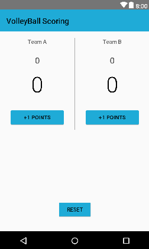

# ABND-Proj2-VolleyBall-Scoring

The second project in the Android Basics nanodegree by Google and Udacity: "**Score Kepper App**".
It is an application on the learnt concepts of binding the layout and java code in the second course "User Input".

***

  

***

## Udacity's Project Overview:

You will be making an app that allows a user to keep track of points within a game.
The goal is to create an Score Keeper app which gives a user the ability to keep track of the score of two different teams playing a game of your choice. To build this project, you can follow along with the practice set and customize the Court Counter app to track scores from a different sport. 

 [Project Rubric](https://review.udacity.com/#!/rubrics/157/view)

## App Overview:

It is basically an app that tracks the score in a volleyball game based on the 25-point system and tracks number of points and sets for each team.

## Android Features:

1. XML Layout of main activity.
2. Java code handling score tracking.
3. Toast Messages.